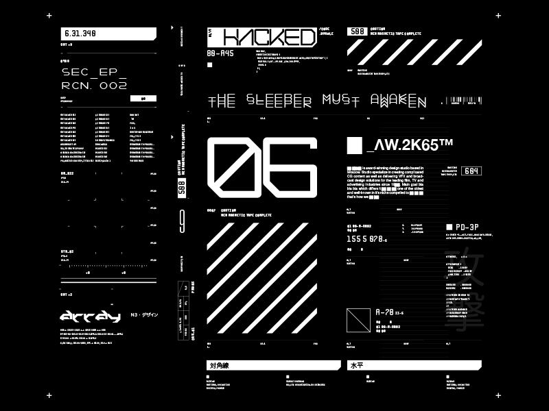

Although an 8x8 LED matrix display carries it's own esthetic, I've recently come across the popular I2C 0.96" OLED module.

It's relatively inexpensive, and it's operable over I2C, which is perfect for the two pins of the ESP-01.

[https://randomnerdtutorials.com/guide-for-oled-display-with-arduino/](https://randomnerdtutorials.com/guide-for-oled-display-with-arduino/)

[https://tinkersphere.com/oled-displays/805-white-oled-module.html](https://tinkersphere.com/oled-displays/805-white-oled-module.html)

[In-Depth: Interface OLED Graphic Display Module with Arduino](https://lastminuteengineers.com/oled-display-arduino-tutorial/)

These are some displays I've come across that I feel inspired by:

